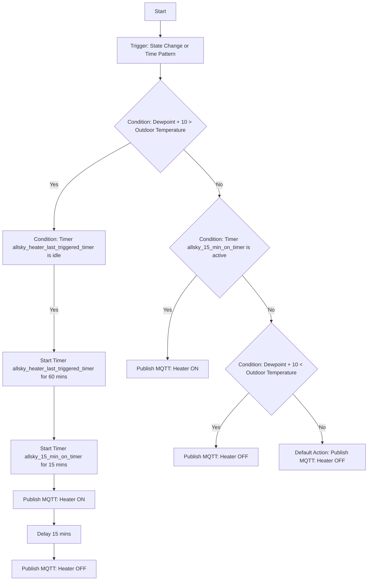

# Control Pi5 GPIO from MQTT

This project allows you to control the GPIO pins on a Raspberry Pi 5 using MQTT messages. The service subscribes to a specified MQTT topic and processes JSON payloads to control the GPIO pins.

## Installation

1. Clone the repository to your Raspberry Pi:
    ```sh
    git clone git@github.com:chvvkumar/RPi5_MQTT_GPIO_control.git
    cd RPi5_MQTT_GPIO_control
    ```

2. Create venv and Install the required dependencies (or run the install script. Please read what it does before running it):
    ```sh
    pip install -r requirements.txt
    ```

3. Configure the service:
    - Edit the `config.txt` file to set your MQTT broker details:
        ```
        [MQTT]
        broker = <your_mqtt_broker>
        port = <your_mqtt_port>
        topic = <your_mqtt_topic>
        username = <your_mqtt_username>
        password = <your_mqtt_password>
        ```

4. Install and start the systemd service:
    ```sh
    sudo ./install.sh
    ```

## Usage

Send a JSON payload to the configured MQTT topic to control the GPIO pins. Below is an example of a JSON payload:

```json
{
	"MQTT_OutTemp": 39.56,
	"MQTT_OutHumidity": 81,
	"MQTT_OutDP": 34.2,				
	"MQTT_GPIO": {
		"21": {
			"name": "Heater",
			"pin": 21,
			"direction": "out",
			"state": "off"
		}
	}

}
```

or control multiple GPIO pins like this

```json
{
	"MQTT_OutTemp": 39.56,
	"MQTT_OutHumidity": 81,
	"MQTT_OutDP": 34.2,				
	"MQTT_GPIO": {
		"21": {
			"name": "Heater",
			"pin": 21,
			"direction": "out",
			"state": "off"
		}
		"21": {
			"name": "Dome",
			"pin": 22,
			"direction": "out",
			"state": "on"
		}
	}

}
```


## Example Home Assistant automation:

Home Assistant Helper Timers:

1. `timer.allsky_15_min_on_timer` - 15 minute ON timer - Turn on time for the Heater
2. `timer.allsky_heater_last_triggered_timer` - 60 minute interval timer - Waits 60 minutes from the last tiem it turned on before turning on the heater again



```yaml
alias: Allsky - Dew Heater Control
description: ""
triggers:
  - entity_id:
      - sensor.dewpoint
      - sensor.outdoor_temperature
    trigger: state
  - trigger: state
    entity_id:
      - sensor.outdoor_humidity
  - trigger: time_pattern
    minutes: /5
  - trigger: state
    entity_id:
      - timer.allsky_15_min_on_timer
conditions: []
actions:
  - choose:
      - conditions:
          - condition: and
            conditions:
              - condition: template
                value_template: >-
                  {{ (states('sensor.dewpoint') | float + 10) >
                  (states('sensor.outdoor_temperature') | float) }}
              - condition: state
                entity_id: timer.allsky_heater_last_triggered_timer
                state: idle
        sequence:
          - action: timer.start
            metadata: {}
            data:
              duration: "01:00:00"
            target:
              entity_id:
                - timer.allsky_heater_last_triggered_timer
          - action: timer.start
            metadata: {}
            data:
              duration: "00:15:00"
            target:
              entity_id:
                - timer.allsky_15_min_on_timer
          - data:
              topic: Astro/AllSky/GPIO/out
              payload: "{\n\t\"MQTT_OutTemp\": {{ states('sensor.outdoor_temperature') }},\n\t\"MQTT_OutHumidity\": {{ states('sensor.outdoor_humidity') }},\n\t\"MQTT_OutDP\": {{ states('sensor.dewpoint') }},\t\t\t\t\n\t\"MQTT_GPIO\": {\n\t\t\"21\": {\n\t\t\t\"name\": \"Heater\",\n\t\t\t\"pin\": 21,\n\t\t\t\"direction\": \"out\",\n\t\t\t\"state\": \"on\"\n\t\t}\n\t}\n\n}"
              retain: true
            action: mqtt.publish
          - delay:
              hours: 0
              minutes: 15
              seconds: 0
              milliseconds: 0
          - data:
              topic: Astro/AllSky/GPIO/out
              payload: "{\n\t\"MQTT_OutTemp\": {{ states('sensor.outdoor_temperature') }},\n\t\"MQTT_OutHumidity\": {{ states('sensor.outdoor_humidity') }},\n\t\"MQTT_OutDP\": {{ states('sensor.dewpoint') }},\t\t\t\t\n\t\"MQTT_GPIO\": {\n\t\t\"21\": {\n\t\t\t\"name\": \"Heater\",\n\t\t\t\"pin\": 21,\n\t\t\t\"direction\": \"out\",\n\t\t\t\"state\": \"off\"\n\t\t}\n\t}\n\n}"
              retain: true
            action: mqtt.publish
      - conditions:
          - condition: state
            entity_id: timer.allsky_15_min_on_timer
            state: active
        sequence:
          - data:
              topic: Astro/AllSky/GPIO/out
              payload: "{\n\t\"MQTT_OutTemp\": {{ states('sensor.outdoor_temperature') }},\n\t\"MQTT_OutHumidity\": {{ states('sensor.outdoor_humidity') }},\n\t\"MQTT_OutDP\": {{ states('sensor.dewpoint') }},\t\t\t\t\n\t\"MQTT_GPIO\": {\n\t\t\"21\": {\n\t\t\t\"name\": \"Heater\",\n\t\t\t\"pin\": 21,\n\t\t\t\"direction\": \"out\",\n\t\t\t\"state\": \"on\"\n\t\t}\n\t}\n\n}"
              retain: true
            action: mqtt.publish
      - conditions:
          - condition: template
            value_template: >-
              {{ (states('sensor.dewpoint') | float + 10) <
              (states('sensor.outdoor_temperature') | float) }}
        sequence:
          - data:
              topic: Astro/AllSky/GPIO/out
              payload: "{\n\t\"MQTT_OutTemp\": {{ states('sensor.outdoor_temperature') }},\n\t\"MQTT_OutHumidity\": {{ states('sensor.outdoor_humidity') }},\n\t\"MQTT_OutDP\": {{ states('sensor.dewpoint') }},\t\t\t\t\n\t\"MQTT_GPIO\": {\n\t\t\"21\": {\n\t\t\t\"name\": \"Heater\",\n\t\t\t\"pin\": 21,\n\t\t\t\"direction\": \"out\",\n\t\t\t\"state\": \"off\"\n\t\t}\n\t}\n\n}"
              retain: true
            action: mqtt.publish
    default:
      - data:
          topic: Astro/AllSky/GPIO/out
          payload: "{\n\t\"MQTT_OutTemp\": {{ states('sensor.outdoor_temperature') }},\n\t\"MQTT_OutHumidity\": {{ states('sensor.outdoor_humidity') }},\n\t\"MQTT_OutDP\": {{ states('sensor.dewpoint') }},\t\t\t\t\n\t\"MQTT_GPIO\": {\n\t\t\"21\": {\n\t\t\t\"name\": \"Heater\",\n\t\t\t\"pin\": 21,\n\t\t\t\"direction\": \"out\",\n\t\t\t\"state\": \"off\"\n\t\t}\n\t}\n\n}"
          retain: true
        action: mqtt.publish
mode: restart

```

